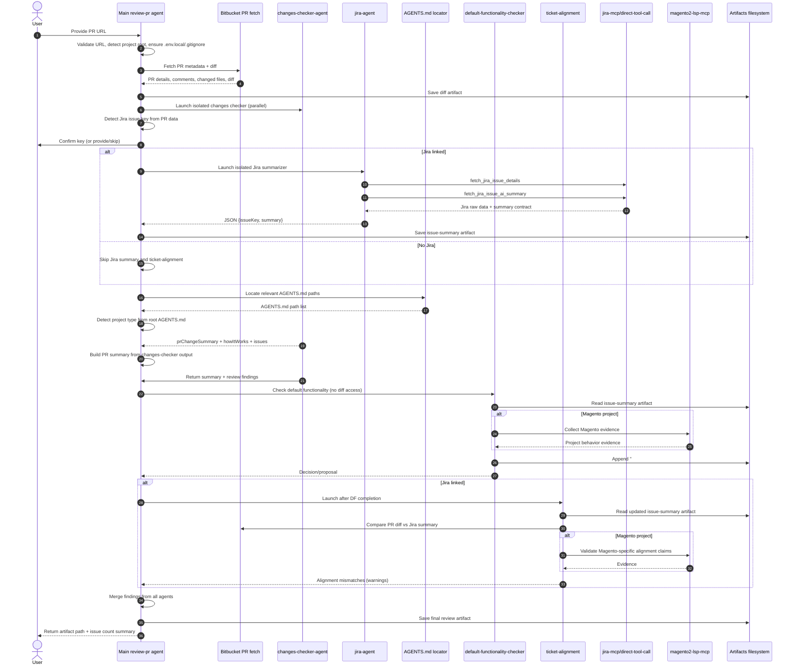

# Review

## Flow

- Agent always asks user to confirm project root, or asks for absolute project root path if it is not clear.
- Agent asks for PR URL.
- User provides PR URL.
- Agent validates URL shape, detects git provider, and runs `pr-fetch` with provider + PR URL for Bitbucket.
- If provider is GitHub, agent responds: `not supported yet`.
- `pr-fetch` returns PR details, comments, and full diff to the agent.
- Agent launches isolated `changes-checker-agent` right after diff artifact is saved and continues the main flow in parallel.
- Agent determines Jira issue key from PR data.
- Agent always asks user to confirm detected Jira issue key.
- If key is not in PR details, agent asks user to provide one or confirm skipping Jira step when PR is not Jira-related.
- If Jira issue key is provided, agent launches isolated subagent `jira-agent` (`~/.agents/agents/jira-agent.md`) that fetches raw issue data via `fetch_jira_issue_details`, MUST call `jira_issue_summary_prompt`, and generates the summary from that returned prompt contract; main agent then saves only that subagent output to the issue-summary artifact file.
- After Jira summary is saved, agent launches another isolated subagent `functionality-checker-agent` (`~/.agents/agents/functionality-checker-agent.md`) to validate whether Jira requirements are already covered by existing/default project functionality. This subagent must not inspect PR diff and returns implementation status/explanation (with exact files) plus a project-specific `implementationProposal` when status is `not_implemented`; main agent appends that output to the issue-summary artifact.
- `changes-checker-agent` performs PR code review (quality, standards, architecture, bug risk, security) using guardrails/checklists.
- Agent checks whether Jira issue scope is aligned with PR implementation.
- Agent builds the PR summary from `changes-checker-agent` output (fallback summarizer only when changes checker output is missing/incomplete).
- Agent saves PR review artifact(s) at the end.

## Sequence diagram

### Agent dependencies

- Always spawned: `changes-checker-agent`, `AGENTS.md locator`.
- Jira flow only: `jira-agent`, `default-functionality-checker`, `ticket-alignment`.
- Ordering constraints: `jira-agent` must finish before writing issue summary; `default-functionality-checker` must finish before `ticket-alignment` starts.
- Review ownership: code-review findings are produced by `changes-checker-agent`.
- Summary dependency: main agent uses `changes-checker-agent` summary fields by default; separate summarizer is fallback-only.
- Conditional dependency: when project type is Magento 2, agents making Magento-specific claims must use `magento2-lsp-mcp` as evidence.
- Fallback dependency: `jira-agent` uses `jira-mcp` first, then `direct-tool-call` fallback when MCP is unavailable.

## Inputs

- PR URL from user.
- Optional Jira issue key confirmation from user.
- Environment values in `$PROJECT_ROOT/.env.local` for Bitbucket fetch.
- Jira/LLM values in `~/.agents/mcp/jira-mcp/.env` (or passed as MCP tool arguments) when Jira summary step is used by the isolated Jira subagent.

## Token setup tip

- Bitbucket API token: generate at `https://id.atlassian.com/manage-profile/security/api-tokens`.
- Jira API token/PAT: use a **standard Atlassian API token** from `https://id.atlassian.com/manage-profile/security/api-tokens` (use the regular **Create API token** option, not **Create API token with scopes**, unless your org explicitly requires scoped tokens).

## Outputs

- PR review artifacts in `$PROJECT_ROOT/.agents/artifacts/`.

## Runtime notes

- Prefer execution-first flow: run the main command and remediate concrete failures (missing files/dirs/deps/env) instead of broad pre-check passes.
- `pr-fetch` requires a Node runtime with global `fetch` support (Node 18+).
- If the local default Node is older (for example Node 17) and commands fail with `fetch is not defined`, run PR fetch with Node 25 and run Jira via `uv`:
  - `PROJECT_ROOT="{PROJECT_ROOT}" npx -y node@25 --loader ts-node/esm src/function.ts bitbucket {PR_URL}` from `~/.agents/skills/review-pr/scripts/pr-fetch`
  - `uv run jira-mcp` from `~/.agents/mcp/jira-mcp`
- Jira summarization must attempt fallback when Jira MCP is unavailable: use `direct-tool-call` skill to call `fetch_jira_issue_details` before declaring Jira step failed.
- `magento2-lsp-mcp` is expected to be preinstalled in this environment; skip reinstall in standard review runs.
- If project type is Magento 2 / Adobe Commerce, isolated `functionality-checker-agent` should use `magento2-lsp-mcp` for Magento-specific claims.

## Jira isolation contract

- Main agent must use Jira context only from the isolated Jira subagent output.
- If subagent output is invalid JSON or missing required fields (`issueKey`, `summary`), stop and fail instead of continuing with partial Jira context.
- If `summary` is missing required `jira_issue_summary_prompt` headings, stop and fail instead of accepting partial structure.
- Main agent must not merge Jira facts from direct Jira tool calls after subagent launch.

### Artifact naming convention

- Format: `<YYYY>-<mm>-<dd>-pr-<repo_slug>-<number>-<artifact_type>`
- `repo_slug` is extracted from PR URL repo segment (example: `project_sunny-eu` from `https://bitbucket.org/vaimo/project_sunny-eu/pull-requests/726/`)
- `number` is extracted from PR URL PR number segment (example: `726`)
- `artifact_type` examples: `diff`, `issue-summary`, `review`

Examples in `$PROJECT_ROOT/.agents/artifacts/`:
- `YYYY-mm-dd-pr-<repo_slug>-<number>-diff.patch`
- `YYYY-mm-dd-pr-<repo_slug>-<number>-issue-summary.md`
- `YYYY-mm-dd-pr-<repo_slug>-<number>-review.md`

### Review artifact content

- Put the complete review into `-review.md`.
- Include findings, suggested fixes, and optional code snippets in the same file.
- Do not create a separate `-review-inline.json` artifact.
